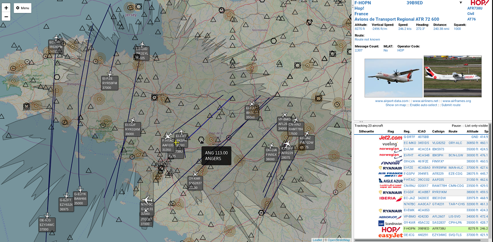

# VRS Waypoints
Support for waypoints and navaids in Virtual Radar Server.

## Setup
  * Create wptgen programm : in src directory execute make command
  * Create waypoints.html file with for example : ./src/wptgen -f data/fix.dat -n data/nav.dat 48.5 1.5 > waypoints.html
  * Install the [Custom Content Plugin](http://www.virtualradarserver.co.uk/Documentation/CustomContent/Default.aspx)
  * Set "Site root folder" to "Images" folder
  * Inject "waypoints.html" and "vrs-waypoints.html" to all addresses at End of HEAD

  

## Notes
 * Use wptgen -h to get the options. You have to give the center position you want to cover to limit the size of the generated waypoints.html file.
 * wptgen use fix.dat and nav.dat database file. They are under GPL and was originaly maintened by the X-plane community. X-plane 11 don't use them anymore, but FlightGear continue to use them.
 * The fix.dat and nav.dat included here comme from https://sourceforge.net/p/flightgear/navdata/ci/master/tree/Navaids/
